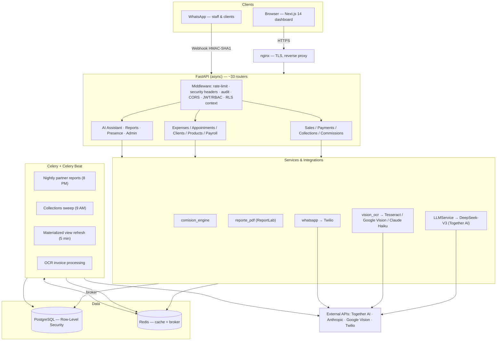
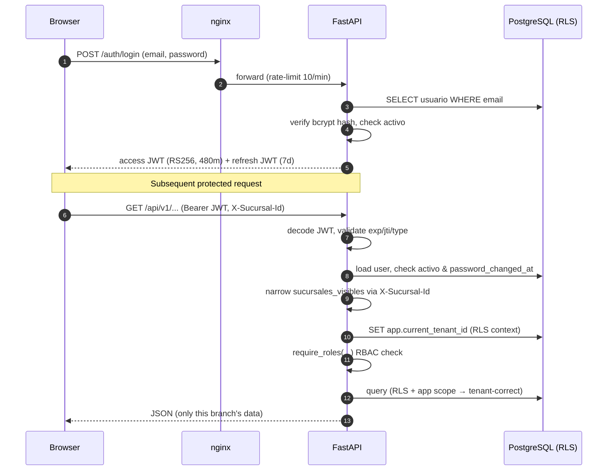
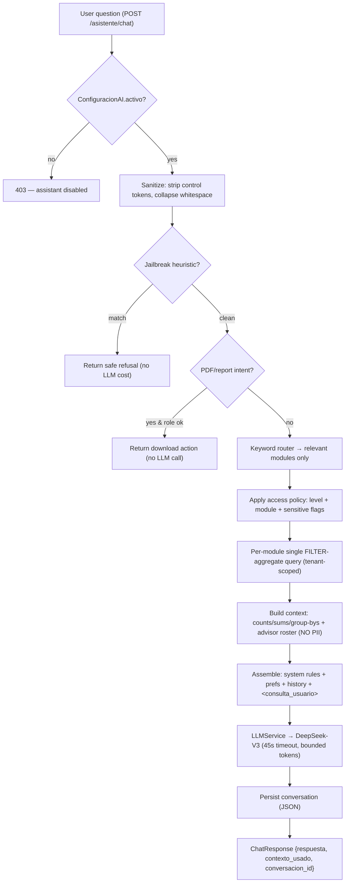
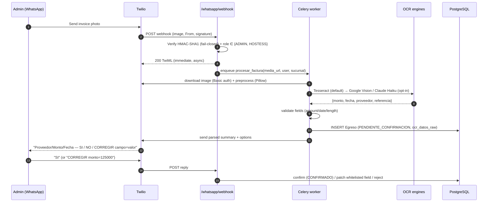
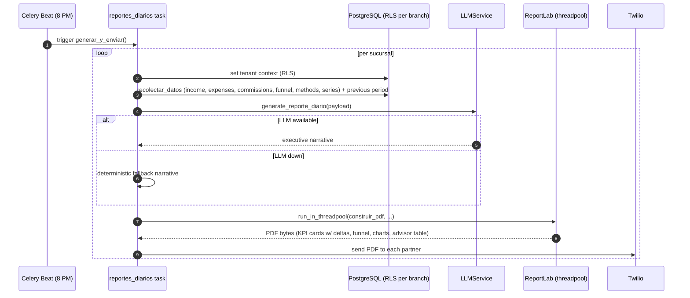
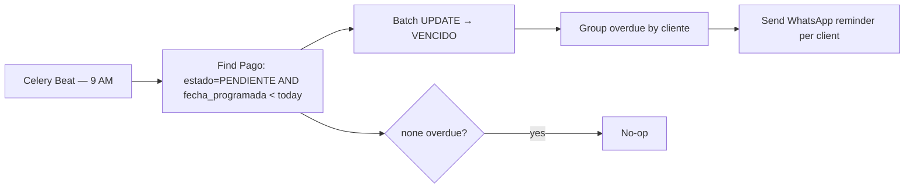
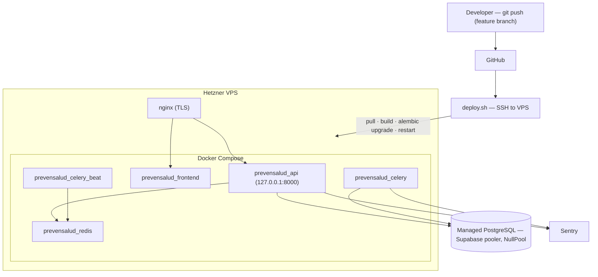
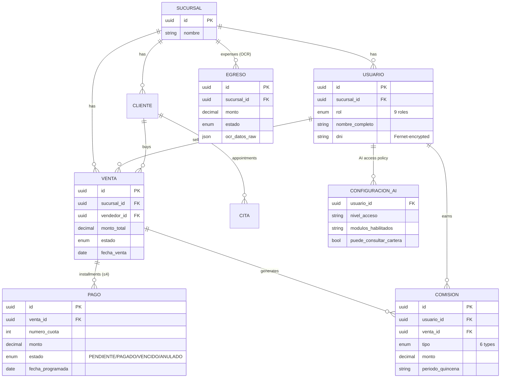

# System Design — PrevenSalud CRM+

Mermaid diagrams for the major flows. They render on GitHub and in the HTML showcase
(`../html-presentation/index.html`). Every diagram reflects the actual implementation.

---

## 1. Component / container diagram

---

## 2. Authentication & multi‑tenant request flow

---

## 3. AI assistant — contextual retrieval flow

---

## 4. OCR invoice processing over WhatsApp

---

## 5. Automated executive PDF report

> The same `generar_reporte_pdf` path backs the in‑app, role‑gated, rate‑limited
> (`8/minute;40/hour`) `GET /reportes/pdf` endpoint.

---

## 6. Collections (cobranza) automation

---

## 7. Deployment topology

---

## 8. Simplified data model (tenant‑scoped core)

> All operational tables inherit `TenantMixin` (`sucursal_id`) and `TimeStampMixin`
> (`created_at`/`updated_at`). `audit_logs` is intentionally global and INSERT‑only.
